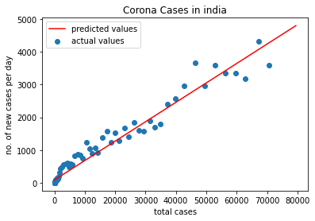
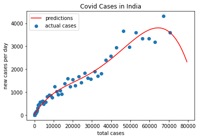

# Covd19-India
This is my attempt to understand the current situation of the pandemic by analysing the Covid-19 data for India
The data is collected from covid19india.org

The polynomial regression model as an R2 score of 0.97814 and the linear model as a score of 0.9625,
Hope that the situation improves
 ## Linear-Model graph
 
 
 ## Poly-regression graph(based on data till 11 may,2020)
 
 
 ## Poly-regression graph(based on data till 18 may,2020)
 .png)
